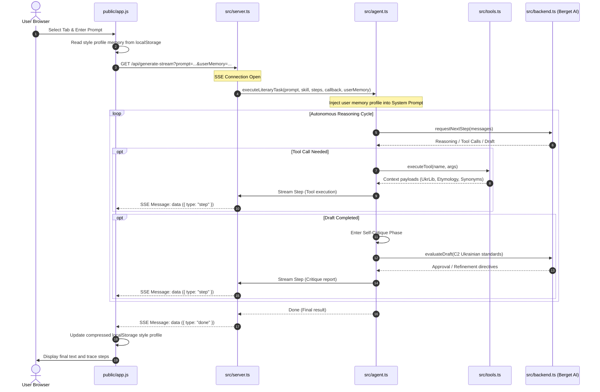

# System Architecture & Codebase Guide

This document explains the overarching design of the Ukrainian Creative Writing Agent, the role of every file in the project, how the code works (especially the TypeScript files), and how they interact with each other.

---

## 1. Modular System Architecture

The project is built upon the decoupled **"Your Agent"** blueprint. This architecture strictly separates the **autonomous reasoning and self-critique loop** from stateless linguistic instructions and concrete archive query tools, enriched with real-time SSE streaming, secure diagnostics, and personalized session memory:

```text
┌────────────────────────────────────────────────────────┐
│                   Web Application GUI                  │
│  (Tab Switcher, Live SSE Timeline, TTS Karaoke Player) │
└───────────────────────────┬────────────────────────────┘
                            │ GET /api/generate-stream?prompt=...&userMemory=...
┌───────────────────────────▼────────────────────────────┐
│                    Agent Core Engine                   │
│   Iterative Loop: Draft ➔ Tool Call ➔ Critique ➔ Refine│
│   (Injects compressed User Linguistic Profile Memory)  │
└──────┬──────────────────────────────────────────┬──────┘
       │ Loads Instructions                       │ Calls Actions
┌──────▼────────────────────┐              ┌──────▼────────────────────┐
│     Stateless Skills      │              │      External Tools       │
│  • custom_task [NEW]      │              │  • synonym_lookup         │
│  • stylistic_shift        │              │  • etymology_check        │
│  • rhyme_and_rhythm       │              │  • reference_ukrlib       │
└───────────────────────────┘              └───────────────────────────┘
```

---

## 2. Directory Structure

```text
Assignment2/
│
├── .skills/            # System Prompts (Markdown instruction files for the AI)
│   ├── custom_task/instructions.md        # [NEW] Freeform instructions
│   ├── stylistic_shift/instructions.md
│   └── rhyme_and_rhythm/instructions.md
│
├── src/                # Backend TypeScript Code
│   ├── agent.ts        # The "Brain" (AI Reasoning Loop with User Memory injection)
│   ├── backend.ts      # The "Mouth/Ear" (Berget AI API Connection)
│   ├── heartbeat.ts    # [NEW] Secure zero-cost local health checking
│   ├── skills.ts       # The "Knowledge" (Loads the .skills directory)
│   ├── tools.ts        # The "Hands" (External dictionary/grammar tools)
│   ├── server.ts       # The "Web Bridge" (SSE Streaming & TTS Proxy Server)
│   └── index.ts        # The "Terminal Demo" (CLI driver)
│
├── public/             # Frontend Web GUI
│   ├── index.html      # Structure (Tabbed switcher and input controls)
│   ├── style.css       # Design (Tab buttons & Linen glassmorphism)
│   └── app.js          # Logic (Client state, Local Profile Memory, & Karaoke TTS)
│
├── docs/               # Developer Documentation guides
│   └── architecture_guide_en.md
│
├── Dockerfile          # Container config for Hugging Face Spaces
├── package.json        # Node.js dependencies and run scripts
├── tsconfig.json       # TypeScript compiler rules
└── README.md           # Project Overview
```

---

## 3. System Interaction Flow

How do these files talk to each other during a generation cycle? Here is the detailed interaction diagram:



### 🔁 Deep Dive: Key Integrations

#### 1. Real-time Server-Sent Events (SSE) Streaming
*   Instead of waiting several seconds for a single HTTP POST request to complete, `server.ts` exposes a GET route `/api/generate-stream` that leverages standard HTTP connections to stream progress events live to `app.js` using `EventSource`.
*   This keeps the interface feeling alive and engaging as users watch the agent think, execute tools, and critique itself.

#### 2. Local Session Memory (Linguistic Profile)
*   **Privacy & Efficiency**: All user personalization resides securely inside the browser's `localStorage` (private to the user).
*   **API Cost Minimization**: Instead of forwarding raw chats (which rapidly skyrockets API fees), the client compresses stylistic trends and favorite genres into a micro-profile (max 450 characters / ~90 tokens).
*   This adds negligible costs to the developer's Berget AI bill while allowing the agent to continuously customize its steps based on your history.

#### 3. Secure Fallback TTS Proxy
*   Native browser Speech Synthesis frequently fails to read Cyrillic if the host machine does not have the Ukrainian language package installed locally.
*   To solve this, `server.ts` implements `/api/tts-proxy?text=...`, which securely requests audio streams directly from Google Translate TTS.
*   By fetching this on the server side, it bypasses browser CORS blocks and Referer security locks, streaming high-fidelity audio flawlessly on any machine.
*   Word timings are calculated dynamically to align precisely with karaoke highlighting, even for words containing Ukrainian apostrophes (`’`).

---

## 4. Deep Dive into Backend TypeScript Code

### 🧠 1. `src/agent.ts` (The Brain)
*   **User Memory Integration**: When the `userMemory` string is passed, it is prepended directly into the LLM system prompt context, instructing the Llama 3 model to customize its strategy, draft registers, and self-critiques dynamically.
*   **Self-Critique & Verification**: Forces the LLM to inspect drafts against strict C2 benchmarks (Linguistic Purity vs. Surzhyk/loanwords) and loops iteratively until approval or step-budget exhaustion.

### 🌐 2. `src/server.ts` (The Web Bridge)
*   Routes incoming queries and streams raw trace structures.
*   Exposes `/api/heartbeat`, an extremely secure diagnostic checking function that reports on filesystem accessibility, API configurations, and folder structure without leaking active API keys.
