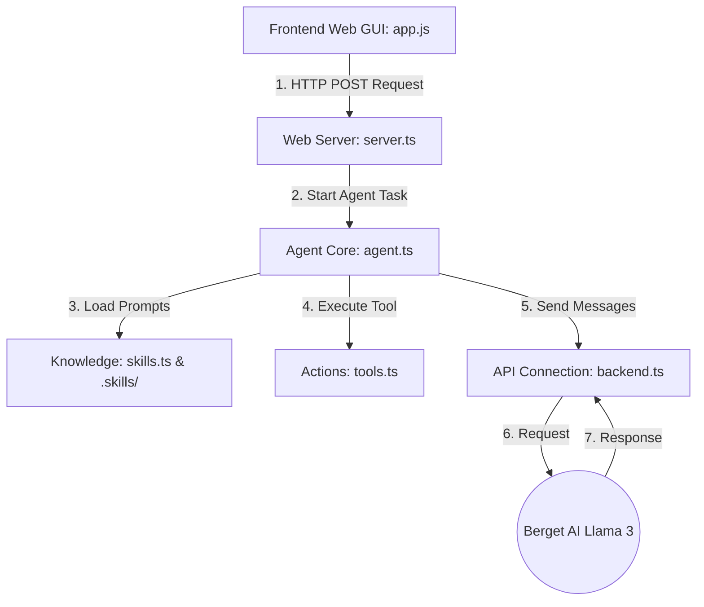

# System Architecture & Codebase Guide

This document explains the overarching design of the Ukrainian Creative Writing Agent, the role of every file in the project, how the code works (especially the TypeScript files), and how they interact with each other.

---

## 1. Modular System Architecture

The project is built upon the decoupled **"Your Agent"** blueprint. This architecture strictly separates the **autonomous reasoning and self-critique loop** from stateless linguistic instructions and concrete archive query tools:

```text
┌────────────────────────────────────────────────────────┐
│                   Web Application GUI                  │
│  (Dynamic Dropdowns, TTS Karaoke, Light Linen Theme)   │
└───────────────────────────┬────────────────────────────┘
                            │ HTTP POST /api/generate
┌───────────────────────────▼────────────────────────────┐
│                    Agent Core Engine                   │
│   Iterative Loop: Draft ➔ Tool Call ➔ Critique ➔ Refine│
└──────┬──────────────────────────────────────────┬──────┘
       │ Loads Instructions                       │ Calls Actions
┌──────▼────────────────────┐              ┌──────▼────────────────────┐
│     Stateless Skills      │              │      External Tools       │
│  • stylistic_shift        │              │  • synonym_lookup         │
│  • rhyme_and_rhythm       │              │  • etymology_check        │
│                           │              │  • reference_ukrlib       │
└───────────────────────────┘              └───────────────────────────┘
```

---

## 2. Directory Structure

```text
Assignment2/
│
├── .skills/            # System Prompts (Markdown instruction files for the AI)
│   ├── stylistic_shift/instructions.md
│   └── rhyme_and_rhythm/instructions.md
│
├── src/                # Backend TypeScript Code
│   ├── agent.ts        # The "Brain" (AI Reasoning Loop)
│   ├── backend.ts      # The "Mouth/Ear" (Berget AI API Connection)
│   ├── skills.ts       # The "Knowledge" (Loads the .skills directory)
│   ├── tools.ts        # The "Hands" (External dictionary/grammar tools)
│   ├── server.ts       # The "Web Bridge" (Express REST API Server)
│   └── index.ts        # The "Terminal Demo" (CLI driver)
│
├── public/             # Frontend Web GUI
│   ├── index.html      # Structure (DOM layout)
│   ├── style.css       # Design (Glassmorphism styling)
│   └── app.js          # Logic (Client state & diff highlighting)
│
├── Dockerfile          # Container config for Hugging Face Spaces
├── .dockerignore       # Files to exclude from Docker builds
├── .gitignore          # Files to exclude from GitHub version control
├── package.json        # Node.js dependencies and run scripts
├── tsconfig.json       # TypeScript compiler rules
└── README.md           # Project Overview
```

---

## 3. System Interaction Flow

How do these files talk to each other during a generation cycle? Here is a detailed interaction diagram.



### 🔁 The Core Inference Loop
1. **User Input:** The user clicks a button in `app.js` (or runs `index.ts`), sending a prompt to `server.ts`. 
2. **Execution:** `server.ts` calls `executeLiteraryTask()` inside `agent.ts`.
3. **Reasoning:** `agent.ts` asks `backend.ts` to contact Berget AI. The AI thinks, writes a draft, uses `tools.ts` to check words, critiques itself, and refines the text.
4. **Output:** The polished text is returned to `app.js`, which highlights the dynamically changed words in Cyan.

---

## 4. Deep Dive into `.ts` Files

TypeScript (`.ts`) is simply JavaScript enriched with **"Types"**. Types act like strict rules defining what shape data must have (e.g., "This must be text", "This must be a number"). This prevents bugs before the code even runs.

### 🧠 1. `src/agent.ts` (The Brain)
**Role:** This is the core conductor. It orchestrates the entire "Write -> Critique -> Refine" autonomous loop.

**Code Breakdown:**
*   `interface AgentExecutionTrace`: Defines the "Type" (rule) for the memory log. It declares that every log entry must have a `step` (number), `action` (text), and `details` (text).
*   `async function executeLiteraryTask(...)`: The `async/await` keywords mean the code will "pause and wait" for the AI to respond over the internet without freezing the whole server.
*   **The While Loop (`while (step <= maxSteps)`)**: The code keeps asking the AI for its next logical action until the AI definitively outputs the `[FINAL_OUTPUT]` tag.

### 🌐 2. `src/backend.ts` (The API Connection)
**Role:** Handles all direct communication over the internet with Berget AI endpoints.

**Code Breakdown:**
*   `export interface Message { role: string, content: string }`: Strictly defines how messages must be formatted before sending them to the AI (e.g., role: "user", content: "Hello").
*   `fetch(url, { method: 'POST', ... })`: This is the standard web command to send data to another computer. It includes your `BERGET_API_KEY` securely hidden in the HTTP headers.
*   **Fallback Logic (`if (!apiKey)`)**: If you don't have an API key configured locally, this file intercepts the request and generates a mock "Simulation" response so the app doesn't crash during testing.

### 📚 3. `src/skills.ts` (The Knowledge Base)
**Role:** Stores the specific instructions (system prompts) that tell the AI *how* to behave (e.g., "Act like Taras Shevchenko").

**Code Breakdown:**
*   `export type SkillName = 'stylistic_shift' | 'rhyme_and_rhythm'`: This restricts the system so it can *only* ask for these specific skills. If you type a typo elsewhere in the code, TypeScript will throw an error immediately!
*   `const skillsRegistry`: A dictionary mapping the skill name to a massive text block of instructions injected into the AI's context window behind the scenes. This now strictly enforces the output of `[PHONETICS]` guides at the end of each generation.

### 🔧 4. `src/tools.ts` (External Tools)
**Role:** Provides functions that the AI can choose to "call" during its reasoning loop to gather more information (like looking up a dictionary).

**Code Breakdown:**
*   `availableTools`: A list of tools described in JSON schema format. We send this list to the AI so it knows exactly what tools it is allowed to use.
*   `function executeTool(name, args)`: A switchboard router. If the AI asks to run `synonym_lookup`, this function executes the fake dictionary lookup logic and returns the structured result back to the AI.

### 🌉 5. `src/server.ts` (The Web Server)
**Role:** The bridge between the Frontend GUI (HTML/JS) and the Backend Core (TypeScript). It listens for internet requests on port 7860.

**Code Breakdown:**
*   `import express from 'express'`: Express is an industry-standard framework for easily creating web servers in Node.js.
*   `app.post('/api/generate', ...)`: Creates a specific URL endpoint. When `app.js` sends data here, it extracts the `prompt` and `skill`, feeds them into `executeLiteraryTask()`, and finally sends the computed JSON response back to the browser.

---

## 5. Frontend & Config Files

### 🖥️ `public/` (Frontend GUI)
*   **`index.html`**: The semantic skeleton of the webpage. Contains the dynamic dropdown forms for era/author selection, buttons, and the TTS playback controls.
*   **`style.css`**: The paint and decoration. Uses modern CSS techniques (like `backdrop-filter: blur()`) to create the premium glassmorphic aesthetic over a subtle linen/embroidery background.
*   **`app.js`**: The client-side muscles. It dynamically populates form dropdowns based on user selections, sends requests to `/api/generate` using `fetch()`, intercepts the `[PHONETICS]` AI block for display, and triggers the browser's `SpeechSynthesis` Web API to read the poem aloud while highlighting words in real-time.

### ⚙️ Configuration Files
*   **`package.json`**: The heart of a Node.js project. It lists all downloaded dependencies (like `express` or `typescript`) and defines custom execution commands (like `npm run dev` or `npm start`).
*   **`tsconfig.json`**: Tells the TypeScript compiler how strict its checking should be and where to output the translated raw JavaScript files (e.g., into the `dist/` folder).
*   **`Dockerfile` & `.dockerignore`**: The production recipe for Hugging Face Spaces. It tells the cloud automated builder exactly how to provision a virtual Linux container, install Node.js, copy our project files, and securely launch the server.
